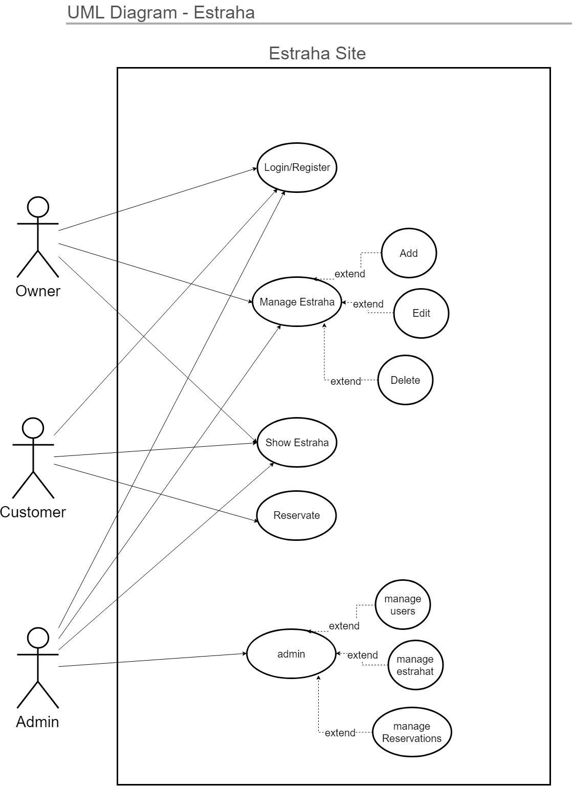
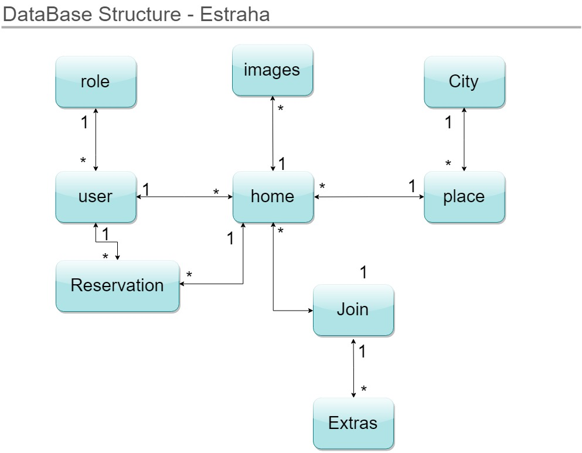
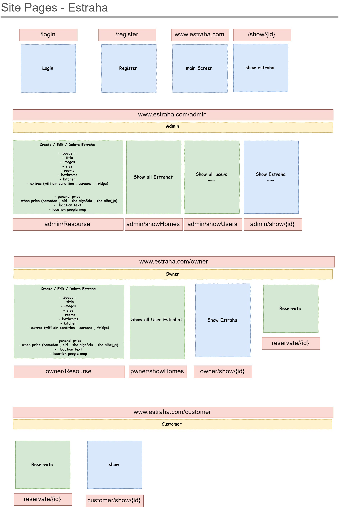

<p align="center">
</p>

<p align="center">
<a href="https://travis-ci.org/laravel/framework"></a>
<a href="https://packagist.org/packages/laravel/framework"></a>
<a href="https://packagist.org/packages/laravel/framework"></a>
<a href="https://packagist.org/packages/laravel/framework"></a>
</p>
 
# About
### idea ?
A web site that shows the Estrahat (homes) images specs and location and also the price
to the visitor of the website , also give the ability to the user to add his own estraha (home) and edit it or delete it anytime.  

## MVP (minimum value product)
lets write them by the type of target user of this website

- public visitor : 
	- can browse all homes
	- can show home and view its images and specs
- customer :
	- can reservate home
- owner :
	- can (add-edit-delete) home
- admin :
	- manage users
	- manage homes
	- manage reservates 


# Planning before program

<p align="center">


</p>

## Site Design
- [Adobe Xd file](https://drive.google.com/file/d/1mK1Xh_chvZPKikPSJcdazsPRTfO7hzcB/view?usp=sharing)

## About the Code

- code writte using laravel freamwork .
- the web site designed with pure CSS .
- Using Ajax for handling forms errors .


# Setup

1- Clone project

2- Go to the folder application using cd command on your cmd or terminal

3- Run in your cmd or terminal :
```bash 
composer install
```

4- Copy .env.example file to .env in the root folder. 

5- Open  .env file and fill the next fields with the your database setting
```bash
DB_CONNECTION= DB_type
DB_HOST= host_ip
DB_PORT= port
DB_DATABASE=yourDBname
DB_USERNAME=username
DB_PASSWORD=password
```
6- run the following commands in the terminal  one by one in order :
```bash
php artisan key:generate
php artisan migrate
php artisan storage:link
composer dump-autoload
php artisan db:seed
php artisan serve
```
open the showed ip then
>login with 
>- username : user3@gmail.com 
>- pass : user
> 
> to check myhomes page


## License

The Laravel framework is open-sourced software licensed under the [MIT license](https://opensource.org/licenses/MIT).
